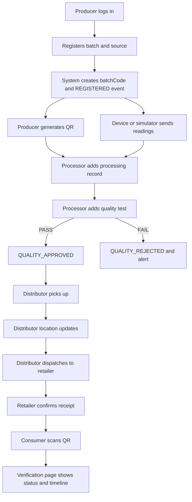

# HoneyTrace — Product Requirements Document (PRD)

| Field | Value |
|---|---|
| Product | HoneyTrace |
| Version | 1.0 (MVP) |
| Status | Ready for implementation |
| Companion docs | `architecture.md` (how it is built), `AGENTS.md` (rules for the AI coding agent) |

**Conventions used in this document**

- **MUST** = required for MVP demo. **SHOULD** = build if time permits, MVP-compatible. **COULD** = optional/stretch. **FUTURE** = not in MVP.
- Requirement IDs (e.g. `FR-BATCH-03`) are stable. Reference them in commits, tests and PRs.
- All API paths are relative to `/api/v1`.

---

## 1. Product Overview

**HoneyTrace** is a web platform that improves **traceability, transparency and verification of honey products** across the chain:

`Producer/Beekeeper → Processor/Quality Inspector → Distributor → Retailer → Consumer`

Each honey batch gets a unique record. Authorized stakeholders add records (harvest, processing, quality tests, transfers, receipt). IoT sensor data (temperature, humidity, weight, TDS) is attached to the batch. A **QR code on the product contains only a verification URL** (e.g. `https://honeytrace.app/verify/HT-2026-7K3QF9`). When a consumer scans it, the backend retrieves the authorized batch record, runs consistency checks and shows a simple verification page.

### 1.1 What "verification" means in HoneyTrace (important, keep honest)

HoneyTrace verifies that **a batch has a complete, consistent, authorized and tamper-evident record trail**. It does **not** perform laboratory adulteration detection. Sensor readings are **supporting traceability/quality information only** and never proof of authenticity. Missing information is reported as *"Information incomplete"*, never as "fake".

### 1.2 Product principles

1. End-to-end working demo beats feature breadth.
2. QR = identifier only. All data lives on the server.
3. Flags are *alerts with evidence*, not accusations.
4. Centralized, auditable data first; blockchain is optional/future.
5. Consumer page must be understandable in under 10 seconds.

---

## 2. Problem Statement

Honey passes through several hands. Information about origin, processing, testing and handling is fragmented across paper records, messages and individual memory. Consumers cannot verify claims; supply-chain partners cannot see a trusted shared history; regulators and brands have no simple way to spot inconsistent or suspicious batches.

**HoneyTrace addresses:** fragmented records, lack of consumer-facing transparency, no shared auditable history, and no systematic flagging of inconsistent or missing information.

---

## 3. Goals

### 3.1 Product goals (MVP)

| ID | Goal |
|---|---|
| G1 | Register a honey batch and give it a unique, non-guessable public code. |
| G2 | Record harvest, processing, quality and supply-chain events by authorized roles only. |
| G3 | Ingest and display IoT/sensor readings (real ESP32 or simulated). |
| G4 | Generate a QR per batch; public verification page resolves it via the backend. |
| G5 | Compute a verification status (`VERIFIED`, `INFORMATION_INCOMPLETE`, `FLAGGED`, `NOT_FOUND`) using transparent rules. |
| G6 | Detect and display suspicious cases as alerts with evidence. |
| G7 | Keep an audit trail and tamper-evident event history. |
| G8 | Run the full 13-step demo (Section 20) without manual data preparation. |

### 3.2 Success metrics (demo-level)

- Full demo scenario completes in < 8 minutes.
- Public verify page loads in < 2 s on a phone over 4G against the deployed backend (cold start excluded).
- 100% of the seeded suspicious cases produce the expected status/flag.
- Automated test suite (Section 21.3) passes.

---

## 4. Target Users

| Role (enum) | Who | Account? |
|---|---|---|
| `PRODUCER` | Beekeeper / honey producer / FPO | Yes (admin-approved) |
| `PROCESSOR` | Processing unit staff **and** quality inspectors/lab staff (one role in MVP; seed 2 users to show both duties) | Yes (admin-approved) |
| `DISTRIBUTOR` | Logistics / wholesale partner | Yes (admin-approved) |
| `RETAILER` | Store / e-commerce seller | Yes (admin-approved) |
| `ADMIN` | Platform operator / regulator-like monitor | Yes (seeded/created by admin) |
| Consumer | Any buyer | **No account** — public page |

---

## 5. User Personas

| Persona | Profile | Needs | Pain today |
|---|---|---|---|
| **Ravi Kale** — Producer | 42, beekeeper near Mahabaleshwar, 120 hives, Android phone, basic English/Marathi | Register a harvest fast (< 2 min), print a QR, show buyers proof | Paper logs, buyers distrust claims |
| **Dr. Anjali Deshmukh** — Quality Inspector | 35, lab technician at a processing unit | Add test results (moisture, HMF, EC) against a batch | Reports live in PDFs/WhatsApp |
| **Sameer Shaikh** — Distributor | 38, runs a small cold-chain van fleet | Record pickup/dispatch and location quickly | No proof of custody & handling |
| **Neha Joshi** — Retailer | 30, organic store owner | Confirm receipt, keep inventory, show QR to customers | Customers ask "is this real?" |
| **Priya Nair** — Consumer | 28, health-conscious buyer | Scan and immediately understand trust level | Labels are marketing claims |
| **Admin (Vikram)** | Platform operator | Approve users, watch alerts, review audit logs | No visibility of anomalies |

---

## 6. User Stories

**Producer**
- US-P-01: As a producer, I register a batch with source, harvest date and quantity so it gets a unique code.
- US-P-02: I pick an approved processor to assign the batch.
- US-P-03: I generate/download a QR code for my batch.
- US-P-04: I register an IoT device and see its readings on my batch.
- US-P-05: I view my batches with status and verification status.

**Processor / Quality Inspector**
- US-Q-01: I see batches assigned to me.
- US-Q-02: I add processing records (method, temperatures, facility).
- US-Q-03: I add a quality test (moisture, HMF, EC, pH, diastase, lab, result).
- US-Q-04: I see the batch move to `QUALITY_APPROVED` or `QUALITY_REJECTED`.

**Distributor**
- US-D-01: I see quality-approved batches available for pickup.
- US-D-02: I record pickup, location updates and dispatch to a retailer.
- US-D-03: I view the supply-chain history of batches I handled.

**Retailer**
- US-R-01: I see batches dispatched to me and confirm receipt (with condition and quantity).
- US-R-02: I maintain inventory (quantity on hand, shelf location).
- US-R-03: I open the batch QR/verification link to display it with the product.

**Consumer**
- US-C-01: I scan a QR (or open the link) without logging in.
- US-C-02: I see a clear status, product/origin/quality info and a timeline.
- US-C-03: I see a clear warning if the batch is flagged, recalled, expired or not found.

**Admin**
- US-A-01: I approve/suspend users and manage roles.
- US-A-02: I monitor all batches and flagged/incomplete records.
- US-A-03: I review, acknowledge and resolve alerts with a note.
- US-A-04: I search audit logs.

---

## 7. Functional Requirements

### 7.1 Authentication & users (AUTH)
| ID | Requirement | Pri |
|---|---|---|
| FR-AUTH-01 | Email + password login returns a signed JWT access token and user profile. | MUST |
| FR-AUTH-02 | Passwords hashed with bcrypt (cost ≥ 12). | MUST |
| FR-AUTH-03 | Only users with `status = APPROVED` can log in. `PENDING`/`SUSPENDED` get a clear error. | MUST |
| FR-AUTH-04 | `GET /auth/me` returns current user; role always read from DB, not from token claims. | MUST |
| FR-AUTH-05 | Request-access (self-registration) creates a `PENDING` user for admin approval. Role chosen must be in {PRODUCER, PROCESSOR, DISTRIBUTOR, RETAILER}; `ADMIN` can never be self-registered. | SHOULD |
| FR-AUTH-06 | Logout (client discards token; server records audit event). Refresh tokens not required. | MUST |
| FR-AUTH-07 | Failed logins are rate limited and audit-logged. | MUST |

### 7.2 Batches (BATCH)
| ID | Requirement | Pri |
|---|---|---|
| FR-BATCH-01 | Producer creates a batch (fields in 12.1). System generates `batchCode` (`HT-<YEAR>-<6 chars>` from an unambiguous alphabet, cryptographically random, unique). | MUST |
| FR-BATCH-02 | `producerLotNumber` unique per producer; duplicate → `409` **and** `DUPLICATE_BATCH_IDENTIFIER` alert. | MUST |
| FR-BATCH-03 | Producer can edit a batch only while status is `REGISTERED`. | MUST |
| FR-BATCH-04 | List/detail endpoints are role-scoped (Section 15.3). | MUST |
| FR-BATCH-05 | Producer or Admin can recall a batch with a reason; status → `RECALLED`; alert created. | MUST |
| FR-BATCH-06 | Producer can create/select reusable **honey sources** (apiary/location). | MUST |
| FR-BATCH-07 | `expiryDate` is required; expired batches are shown as expired and flagged. | MUST |
| FR-BATCH-08 | Batches are never hard-deleted in MVP. | MUST |

### 7.3 Processing (PROC) and Quality (QUAL)
| ID | Requirement | Pri |
|---|---|---|
| FR-PROC-01 | Assigned processor adds processing records (fields in 12.2). First record: `REGISTERED → PROCESSING`. A record with `markComplete=true`: `→ PROCESSED`. | MUST |
| FR-PROC-02 | Unassigned processors get `403` and an `UNAUTHORIZED_UPDATE_ATTEMPT` audit/alert. | MUST |
| FR-QUAL-01 | Assigned processor adds a quality test only when batch is `PROCESSED`. Result `PASS → QUALITY_APPROVED`, `FAIL → QUALITY_REJECTED`. | MUST |
| FR-QUAL-02 | System compares entered parameters with configurable reference limits (12.3). `PASS` recorded with out-of-limit parameters → `INCONSISTENT_BATCH_DATA` alert. | MUST |
| FR-QUAL-03 | Quality `FAIL` creates a `QUALITY_TEST_FAILED` alert (HIGH). | MUST |
| FR-QUAL-04 | Records are append-only (no edit/delete in MVP; corrections = new record with note). | MUST |

### 7.4 Supply chain (SC)
| ID | Requirement | Pri |
|---|---|---|
| FR-SC-01 | Distributor **pickup** on a `QUALITY_APPROVED` batch: sets custody to distributor, status `IN_TRANSIT`. | MUST |
| FR-SC-02 | Custodian distributor may add **location updates** (name + optional lat/lng). | MUST |
| FR-SC-03 | Custodian distributor **dispatches** to a specific approved retailer (`toRetailerId`). Sets `pendingRetailerId`. | MUST |
| FR-SC-04 | Only the pending retailer can **confirm receipt** (condition, quantity, note). Status → `AT_RETAILER`; inventory row created. | MUST |
| FR-SC-05 | Every action above writes an immutable `supply_chain_events` row with hash-chain fields (architecture §13). | MUST |
| FR-SC-06 | `GET /batches/:id/timeline` returns chronological events. | MUST |
| FR-SC-07 | Invalid transitions return `409 INVALID_STATE_TRANSITION` and create an audit log. | MUST |
| FR-SC-08 | Batch `IN_TRANSIT` longer than `TRANSIT_MAX_DAYS` (default 7) without receipt → `MISSING_HANDOVER` alert (lazy check). | SHOULD |
| FR-SC-09 | Retailer maintains inventory (`quantityOnHand`, `shelfLocation`). | MUST |

### 7.5 IoT (IOT) — see Section 13
### 7.6 QR & Verification (QR / VER) — see Section 14
### 7.7 Alerts (ALERT)
| ID | Requirement | Pri |
|---|---|---|
| FR-ALERT-01 | Alerts created by the system for the cases in 12.5. Each has type, severity, evidence JSON and dedupe key (no duplicate active alert of the same type+batch+key). | MUST |
| FR-ALERT-02 | Admin can acknowledge, resolve or dismiss an alert with a note. | MUST |
| FR-ALERT-03 | Users see alerts for batches they may access (read-only). | SHOULD |
| FR-ALERT-04 | Admin can trigger `POST /admin/checks/run` to evaluate time-based checks (stale sensor, stuck in transit, expiry). | SHOULD |

### 7.8 Dashboards (DASH), Admin (ADMIN), Audit (AUD)
| ID | Requirement | Pri |
|---|---|---|
| FR-DASH-01 | Each role dashboard shows role-scoped summary cards (12.6). | MUST |
| FR-ADMIN-01 | Admin CRUD-lite on users (create, list, change role/status, approve, suspend). Cannot demote/suspend self. | MUST |
| FR-ADMIN-02 | Admin views all batches, alerts, audit logs, system overview. | MUST |
| FR-AUD-01 | Audit log for: login success/fail, user changes, batch create/update/recall, every event write, device registration, alert status changes, denied (403) writes, QR generation. | MUST |
| FR-AUD-02 | Audit logs are append-only; no update/delete API. | MUST |

---

## 8. Non-Functional Requirements

| ID | Category | Requirement |
|---|---|---|
| NFR-01 | Performance | Public verify endpoint p95 < 800 ms on seeded DB (local). List endpoints paginated (default 20, max 100). |
| NFR-02 | Responsiveness | All pages usable at 360 px width; consumer page is mobile-first. |
| NFR-03 | Usability | Consumer page: status is the first visible element and readable without color (icon + text). |
| NFR-04 | Reliability | Every mutating operation that touches batch + event + alerts runs in a DB transaction. |
| NFR-05 | Security | See Section 19. |
| NFR-06 | Maintainability | TypeScript strict; modular routes/controllers/services; lint + format on commit. |
| NFR-07 | Testability | Automated tests per Section 21.3; seed script is idempotent. |
| NFR-08 | Portability | `docker compose up` gives local Postgres; app runs with `npm install && npm run dev`. |
| NFR-09 | Observability | Structured request logs (no secrets/passwords/tokens/device keys). |
| NFR-10 | Accessibility | Semantic HTML, labels for inputs, focus states, contrast AA for text. |
| NFR-11 | Browser support | Latest Chrome, Edge, Firefox, Safari (iOS 15+). |
| NFR-12 | Time | All timestamps stored UTC (`timestamptz`), displayed in user's locale (default `Asia/Kolkata`). |

---

## 9. MVP Scope

**In scope (MUST unless marked):** everything tagged MUST in Section 7; the 6 role experiences; QR generation and camera scan page (SHOULD); IoT ingestion + simulator; verification rules engine; alerts; audit logs; hash-chained events; seed data; deployment to free-tier hosting.

| Area | MVP | Later |
|---|---|---|
| Data integrity | Centralized DB + audit + SHA-256 hash chain per batch | Blockchain anchoring |
| IoT | HTTP REST ingestion, device API key, simulator | MQTT, OTA, device fleet mgmt |
| Quality | Manual entry of lab/quality results | Lab integration, AI/spectral analysis |
| Auth | Email/password + JWT | SSO, MFA, refresh rotation |
| Notifications | In-app alerts | Email/SMS/WhatsApp |
| Languages | English | Marathi/Hindi/i18n |

## 10. Out of Scope

Full national infrastructure; AI/ML adulteration detection; laboratory-grade authentication; complex blockchain network; tokens/crypto; native mobile app; custom hardware manufacturing; payment gateway; logistics optimization; enterprise-grade infra (HA, multi-region, SOC2). These appear in Section 22 as future enhancements.

---

## 11. User Flows

### 11.1 Happy path (all roles)



### 11.2 Consumer flow
Scan QR (phone camera opens URL, or in-app `/scan` page) → `/verify/:code` → page calls `GET /public/verify/:code` → status banner + details + timeline → optional "Report a problem" is **FUTURE**.

### 11.3 Suspicious-case flow
Any trigger in 12.5 → alert created (with evidence) → batch `verificationStatus` recomputed → admin sees alert in dashboard → admin acknowledges/resolves with note → status recomputed.

### 11.4 Access flow
Request access → status `PENDING` → admin approves (assigns role) → user logs in → role-based dashboard.

---

## 12. Feature Requirements

### 12.1 Batch registration fields
| Field | Type | Required | Validation |
|---|---|---|---|
| productName | string | yes | 3–120 chars |
| honeyType | enum/string | yes | e.g. WILDFLOWER, MULTIFLORA, ACACIA, EUCALYPTUS, JAMUN, FOREST, OTHER |
| producerLotNumber | string | yes | 3–40 chars, `[A-Za-z0-9\-_/]`, unique per producer |
| sourceId **or** newSource | uuid / object | yes | newSource: name, village, district, state, country(default IN), optional lat (-90..90), lng (-180..180), optional floralSource |
| harvestDate | date | yes | not in the future; not older than 2 years |
| harvestMethod | enum | no | MANUAL_EXTRACTION, CENTRIFUGE, PRESSING, OTHER |
| quantityKg | decimal | yes | > 0, ≤ 100000 |
| packagingType | string | no | ≤ 60 chars |
| expiryDate | date | yes | after harvestDate, ≤ harvestDate + 5 years |
| assignedProcessorId | uuid | yes | must be an APPROVED `PROCESSOR` |
| notes | string | no | ≤ 1000 chars |

### 12.2 Processing record fields
`processType` (enum: FILTRATION, SETTLING, MOISTURE_ADJUSTMENT, PASTEURIZATION, PACKAGING, OTHER), `facilityName`, `facilityLocation`, `startedAt`, `completedAt` (≥ startedAt, ≤ now), `maxTemperatureC` (optional, −10..120), `inputQuantityKg`, `outputQuantityKg` (≤ input; large loss > 20% raises `INCONSISTENT_BATCH_DATA` MEDIUM), `markComplete` (boolean), `notes`. Additives/blends: `additivesDeclared` (boolean, default false) with `additivesNotes`; if true, shown on consumer page.

### 12.3 Quality test fields and reference limits
Fields: `testType` (ROUTINE_LAB, THIRD_PARTY_LAB, IN_HOUSE_RAPID), `labName`, `reportReference`, `testedAt`, `moisturePct`, `hmfMgKg`, `electricalConductivityMsCm`, `ph`, `diastaseNumber`, `overallResult` (PASS|FAIL), `notes`. At least one measured parameter required.

Configurable **illustrative** limits in `server/src/config/qualityLimits.ts` (align with FSSAI/Codex later; document as "illustrative"): moisture ≤ 20 %, HMF ≤ 40 mg/kg, EC ≤ 0.8 mS/cm, pH 3.2–4.5, diastase ≥ 8. Out-of-limit + `PASS` ⇒ `INCONSISTENT_BATCH_DATA` (HIGH).

### 12.4 Verification rules engine (authoritative)

Input: batch + processing + quality + events + readings + active alerts. Evaluate in order:

1. Batch code not found → **`NOT_FOUND`**.
2. **`FLAGGED`** if **any**: status `RECALLED`; `expiryDate < today`; latest quality result `FAIL` (`QUALITY_REJECTED`); hash chain invalid; any *active* alert (`OPEN`/`ACKNOWLEDGED`) with `affectsVerification = true` and severity `HIGH` or `CRITICAL`.
3. **`INFORMATION_INCOMPLETE`** if not flagged and **any**: completeness checklist item missing (below); or any active `MEDIUM` alert with `affectsVerification = true`; or batch not yet `AT_RETAILER` (in progress — message says *"This batch is still moving through the supply chain"*).
4. Otherwise **`VERIFIED`**.

Completeness checklist (each is returned to UI as `checks[]` with `passed` boolean and label):
C1 batch record & unique code · C2 origin/source recorded · C3 final processing record · C4 quality test PASS · C5 ≥ 1 sensor reading · C6 custody chain PICKED_UP → DISPATCHED → RECEIVED in correct order · C7 hash chain valid · C8 not expired and not recalled.

The response always includes `reasons[]` (human-readable) so the consumer sees *why*.

### 12.5 Alert catalog (MVP)

| Type | Trigger | Severity | Affects consumer status |
|---|---|---|---|
| `UNKNOWN_BATCH_SCAN` | Verify called with unknown code (batch-less alert, aggregated per code per hour) | LOW | n/a (page shows NOT_FOUND) |
| `DUPLICATE_BATCH_IDENTIFIER` | Duplicate `producerLotNumber` for same producer | MEDIUM | no (batch not created) |
| `UNAUTHORIZED_UPDATE_ATTEMPT` | 403 on a batch write by authenticated user | MEDIUM | no (admin-only) |
| `INVALID_STATE_TRANSITION` | Action attempted in wrong state (e.g., receive before dispatch) | LOW | no |
| `INCONSISTENT_BATCH_DATA` | Quantity/date/limit contradictions (12.2, 12.3) | MEDIUM or HIGH | yes |
| `MISSING_HANDOVER` | Receipt/dispatch without preceding pickup, or transit > `TRANSIT_MAX_DAYS` | HIGH | yes |
| `SENSOR_ABNORMAL` | Reading outside abnormal thresholds (13.4); HIGH if ≥ 3 consecutive or extreme, else MEDIUM | MEDIUM/HIGH | yes |
| `SENSOR_MISSING` | Active batch (REGISTERED…IN_TRANSIT) with no reading in `SENSOR_STALE_HOURS` (default 24) | MEDIUM | yes |
| `UNEXPECTED_LOCATION` | Two consecutive geo-tagged events implying speed > 120 km/h average, or location event after `AT_RETAILER`/`RECALLED` | HIGH | yes |
| `QUALITY_TEST_FAILED` | Quality result FAIL | HIGH | yes |
| `BATCH_RECALLED` / `BATCH_EXPIRED` | Recall action / expiry check | HIGH | yes |
| `CHAIN_INTEGRITY_FAILURE` | Recomputed hash ≠ stored hash | CRITICAL | yes |

### 12.6 Dashboards

Cards per role (role-scoped counts):
- **Producer:** Total batches · Verified · In progress · Flagged · Recent sensor readings (last 5) · Recent events.
- **Processor:** Assigned (awaiting processing) · In processing · Awaiting quality test · Completed.
- **Distributor:** Available for pickup · In my custody · Dispatched · Recent events.
- **Retailer:** Incoming (dispatched to me) · In inventory · Recent receipts.
- **Admin:** Total batches · Verified · Active supply-chain records (`IN_TRANSIT` + in-progress) · Flagged · Open alerts · Pending users · Recent events · Recent sensor readings.
- Charts (only two): **sensor line chart** (temp/humidity over time) on batch detail; **verification status distribution** bar/donut on admin overview.

### 12.7 Pages

**Public:** `/` Landing · `/how-it-works` · `/verify/:code` Consumer verification · `/scan` QR camera scan · `/login` · `/request-access`.
**Producer:** `/producer` overview · `/producer/batches/new` · `/producer/batches` · `/producer/batches/:id` (details, timeline, sensors, QR, devices).
**Processor:** `/processor` assigned · `/processor/batches/:id` (details + processing form + quality form).
**Distributor:** `/distributor` available · `/distributor/batches/:id` (pickup, location update, dispatch, history) · `/distributor/history`.
**Retailer:** `/retailer` received/incoming · `/retailer/batches/:id` (confirm receipt, QR) · `/retailer/inventory`.
**Admin:** `/admin` overview · `/admin/users` · `/admin/batches` · `/admin/alerts` · `/admin/audit-logs`.

### 12.8 Consumer verification page content
1. **Status banner** (icon + text + colour): VERIFIED / INFORMATION INCOMPLETE / FLAGGED / NOT FOUND, with one-line explanation.
2. **"Why this status"** list from `reasons[]` and check marks from `checks[]`.
3. Product name, batch code, honey type, quantity/packaging, expiry.
4. Producer (organization) and origin (village/district/state; coordinates rounded to 2 decimals).
5. Harvest info; processing summary (incl. additives declaration); quality summary (key parameters + PASS/FAIL, lab name).
6. **Supply-chain timeline** (vertical): Producer → Harvest → Processing → Quality Check → Distributor → Retailer → *Consumer verification (now)*. Each item: event type, date/time, stakeholder (organization), location, status, notes.
7. **Sensor summary** (latest + min/max temp, humidity) with disclaimer: *"Sensor data supports traceability and does not by itself prove authenticity."*
8. Warning box for flags: list of active verification-affecting alerts (title + plain description; no internal IDs, no accusatory language).
9. Footer: "Verified against HoneyTrace records at <timestamp>."
Public response must **not** include emails, phone numbers, user IDs, internal notes, device keys or exact farm coordinates.

---

## 13. IoT Requirements

| ID | Requirement | Pri |
|---|---|---|
| FR-IOT-01 | Devices authenticate with `X-Device-Key` header. Keys generated server-side (32 random bytes, base64url), **shown once**, stored as SHA-256 hash. | MUST |
| FR-IOT-02 | Producer/Admin registers a device (`name`, optional `batchId`) and assigns it to one of their batches. | MUST |
| FR-IOT-03 | `POST /iot/readings` accepts `temperatureC`, `humidityPct`, `weightKg`, `tdsPpm` (each optional, at least one required), `recordedAt` (optional, defaults to server time). | MUST |
| FR-IOT-04 | Physical-plausibility validation (reject): temp −20..80 °C; humidity 0..100 %; weight 0..5000 kg; TDS 0..5000 ppm; `recordedAt` not > 5 min in the future nor > 7 days old. | MUST |
| FR-IOT-05 | Store `receivedAt` (server) and `recordedAt` (device). Unique `(deviceId, recordedAt)` prevents replays (409). | MUST |
| FR-IOT-06 | Abnormal thresholds (13.4) mark reading `isAbnormal=true` and may raise `SENSOR_ABNORMAL`. | MUST |
| FR-IOT-07 | Mock simulator: (a) CLI `simulator/` script posting to the real endpoint; (b) `POST /iot/simulate` (Producer/Admin, only when `ENABLE_SIMULATOR=true`) that inserts N readings with scenario `normal` or `abnormal`. | MUST |
| FR-IOT-08 | Get readings (paginated, time-range) and latest reading per batch. | MUST |
| FR-IOT-09 | Device may be revoked (`isActive=false`); revoked keys get `401`. | SHOULD |
| FR-IOT-10 | UI labels sensor data as "supporting information". | MUST |

### 13.4 Illustrative abnormal thresholds (config: `server/src/config/sensorThresholds.ts`)
| Parameter | Normal | Abnormal |
|---|---|---|
| Temperature | 10–30 °C | < 5 or > 35 °C (extreme: > 40 °C) |
| Humidity | 20–65 % | > 75 % |
| Weight | informational | drop > 10 % vs. registered quantity → `INCONSISTENT_BATCH_DATA` MEDIUM (SHOULD) |
| TDS | informational only | none in MVP (not a standard honey authenticity metric) |

These are demo defaults, **not** regulatory standards. State this in code comments and UI help text.

**Sample device payload**
```json
{
  "batchCode": "HT-2026-DEMO01",
  "temperatureC": 26.4,
  "humidityPct": 48.2,
  "weightKg": 49.8,
  "tdsPpm": 312,
  "recordedAt": "2026-03-10T09:15:00Z"
}
```
`batchCode` is optional if the device is already assigned to a batch; if provided it must match the device's assigned batch.

---

## 14. QR Verification Requirements

| ID | Requirement | Pri |
|---|---|---|
| FR-QR-01 | QR encodes only `${PUBLIC_APP_URL}/verify/${batchCode}`. No personal, quality or sensor data. | MUST |
| FR-QR-02 | `POST /batches/:id/qr` creates (or returns existing) QR record and image (PNG data URL + SVG). Idempotent. | MUST |
| FR-QR-03 | Producer/Admin can download PNG. Retailer can view/print QR for their received batches. | MUST |
| FR-QR-04 | `GET /public/verify/:code` is public, rate limited, never returns internal IDs, and always logs a `verification_logs` row (result + hashed IP). | MUST |
| FR-QR-05 | Unknown/malformed code → `200` with `status: NOT_FOUND` (so UI shows friendly page), plus low-severity aggregated alert. Codes not matching the format regex are rejected with `400`→ UI shows same NOT FOUND page. | MUST |
| FR-QR-06 | In-app `/scan` page uses browser camera; falls back to manual code entry. | SHOULD |
| FR-QR-07 | QR may be revoked (`revokedAt`); a revoked QR resolves to a page "This QR was revoked" and status FLAGGED. | COULD |

---

## 15. Authentication & Authorization

### 15.1 Authentication
JWT (HS256) access token, 60 min expiry, payload `{ sub, iat, exp }` (role intentionally **not trusted**; loaded from DB per request together with status check). Sent as `Authorization: Bearer <token>`. Frontend keeps token in memory with `sessionStorage` persistence (documented XSS trade-off; CSP + no `dangerouslySetInnerHTML`). IoT uses `X-Device-Key`. Public endpoints need nothing.

### 15.2 RBAC matrix (server-enforced)

| Capability | PRODUCER | PROCESSOR | DISTRIBUTOR | RETAILER | ADMIN | Public |
|---|:-:|:-:|:-:|:-:|:-:|:-:|
| Create/edit batch (own, REGISTERED) | ✅ | ❌ | ❌ | ❌ | ❌ | ❌ |
| Register honey source | ✅ | ❌ | ❌ | ❌ | ✅ | ❌ |
| Add processing record (assigned) | ❌ | ✅ | ❌ | ❌ | ❌ | ❌ |
| Add quality test (assigned) | ❌ | ✅ | ❌ | ❌ | ❌ | ❌ |
| Pickup / location update / dispatch | ❌ | ❌ | ✅ | ❌ | ❌ | ❌ |
| Confirm receipt / inventory | ❌ | ❌ | ❌ | ✅ | ❌ | ❌ |
| Recall batch | ✅ (own) | ❌ | ❌ | ❌ | ✅ | ❌ |
| Generate QR | ✅ (own) | ❌ | ❌ | ❌ | ✅ | ❌ |
| Register/assign IoT device | ✅ (own) | ❌ | ❌ | ❌ | ✅ | ❌ |
| Read batch/timeline/sensors | scoped | scoped | scoped | scoped | all | verify only |
| Read alerts | scoped (own batches) | scoped | scoped | scoped | all | ❌ |
| Manage alerts | ❌ | ❌ | ❌ | ❌ | ✅ | ❌ |
| Manage users / audit logs / stats | ❌ | ❌ | ❌ | ❌ | ✅ | ❌ |
| Verify batch | ✅ | ✅ | ✅ | ✅ | ✅ | ✅ |

### 15.3 Data-scoping rules for reads
- PRODUCER: `batch.producerId = me`.
- PROCESSOR: `batch.assignedProcessorId = me`.
- DISTRIBUTOR: `status = QUALITY_APPROVED` (available pool) **or** I appear in any event on the batch **or** `currentCustodianId = me`.
- RETAILER: `pendingRetailerId = me` **or** I have a `RECEIVED_BY_RETAILER` event/inventory row for it.
- ADMIN: all.
Out-of-scope access returns `404` (not `403`) for reads to avoid leaking existence; writes return `403`.

---

## 16. Database Requirements
Relational PostgreSQL, managed by Prisma Migrate. Tables: `users`, `honey_sources`, `batches`, `processing_records`, `quality_tests`, `iot_devices`, `sensor_readings`, `supply_chain_events`, `retailer_inventory`, `qr_codes`, `verification_logs`, `alerts`, `audit_logs`. Roles are an enum on `users` (simpler than a roles table); producers/retailers are users with organization fields (no separate tables). Full field lists, keys, indexes, enums in `architecture.md` §7 and §18. Requirements: UUID PKs, `createdAt/updatedAt` on all mutable tables, FK integrity with `ON DELETE RESTRICT`, `numeric` for measurements, `timestamptz`, `jsonb` for evidence/metadata, indexes on all FK and lookup columns.

---

## 17. API Requirements

Base: `/api/v1`. JSON only. Success: `{ "data": ..., "meta"?: { page, pageSize, total } }`. Error: `{ "error": { "code", "message", "details"? } }` (Section 18). Auth column: `Public`, `JWT`, `Device`.

### 17.1 Auth
| Method | Endpoint | Auth | Roles | Request body | Success | Errors |
|---|---|---|---|---|---|---|
| POST | `/auth/login` | Public | – | `{email, password}` | 200 `{token, expiresIn, user}` | 400 VALIDATION_ERROR, 401 INVALID_CREDENTIALS, 403 ACCOUNT_PENDING / ACCOUNT_SUSPENDED, 429 |
| POST | `/auth/request-access` | Public | – | `{name, email, password, role, organizationName, phone?, location?}` | 201 `{id, status:"PENDING"}` | 400, 409 EMAIL_TAKEN, 429 |
| GET | `/auth/me` | JWT | any | – | 200 `{user}` | 401 |
| POST | `/auth/logout` | JWT | any | – | 204 (audit only) | 401 |

Validation: email format/lowercased/≤254; password 8–72 chars with letter+digit; role ∈ allowed self-registration roles; name 2–80.

### 17.2 Users & directory
| Method | Endpoint | Auth | Roles | Request | Success | Errors |
|---|---|---|---|---|---|---|
| GET | `/users` | JWT | ADMIN | query `role,status,q,page,pageSize` | 200 list | 403 |
| POST | `/users` | JWT | ADMIN | `{name,email,password,role,organizationName,...,status?}` | 201 user | 400, 409 |
| PATCH | `/users/:id` | JWT | ADMIN | any of `{name,role,status,organizationName,phone,location}` | 200 user | 400, 404, 409 CANNOT_MODIFY_SELF |
| POST | `/users/:id/approve` | JWT | ADMIN | `{role?}` | 200 user | 404, 409 |
| POST | `/users/:id/suspend` | JWT | ADMIN | `{reason}` | 200 user | 404, 409 CANNOT_MODIFY_SELF |
| GET | `/directory/:role` | JWT | PRODUCER (`processors`), DISTRIBUTOR (`retailers`), ADMIN (any) | – | 200 `[{id, organizationName, location}]` (APPROVED only) | 403 |

Validation: `:role` ∈ {processors, retailers, distributors}; never return emails/phones in directory.

### 17.3 Honey sources
| Method | Endpoint | Auth | Roles | Request | Success | Errors |
|---|---|---|---|---|---|---|
| POST | `/sources` | JWT | PRODUCER | `{name,village,district,state,country?,latitude?,longitude?,floralSource?}` | 201 | 400 |
| GET | `/sources` | JWT | PRODUCER (own), ADMIN | – | 200 list | 403 |

### 17.4 Batches
| Method | Endpoint | Auth | Roles | Request | Success | Errors |
|---|---|---|---|---|---|---|
| POST | `/batches` | JWT | PRODUCER | 12.1 fields | 201 `{batch}` (includes `batchCode`, `status:"REGISTERED"`) | 400, 403, 404 SOURCE/PROCESSOR_NOT_FOUND, 409 DUPLICATE_LOT_NUMBER |
| GET | `/batches` | JWT | any (scoped) | query `status,verificationStatus,q,page,pageSize,sort` | 200 list + meta | 401 |
| GET | `/batches/:id` | JWT | any (scoped) | – | 200 `{batch, source, processing[], quality[], latestSensor, qr?, activeAlerts[]}` | 401, 404 |
| PATCH | `/batches/:id` | JWT | PRODUCER (own) | subset of 12.1 (not code/producer) | 200 | 400, 403, 404, 409 BATCH_LOCKED (status ≠ REGISTERED) |
| GET | `/batches/:id/status` | JWT | any (scoped) | – | 200 `{status, verificationStatus, allowedActions[]}` | 404 |
| POST | `/batches/:id/recall` | JWT | PRODUCER (own), ADMIN | `{reason (10–500)}` | 200 batch | 400, 403, 404, 409 ALREADY_RECALLED |

`:id` is the internal UUID (authenticated APIs). Public API uses `batchCode`.

### 17.5 Processing & quality
| Method | Endpoint | Auth | Roles | Request | Success | Errors |
|---|---|---|---|---|---|---|
| POST | `/batches/:id/processing` | JWT | PROCESSOR (assigned) | 12.2 | 201 `{record, batchStatus}` | 400, 403, 404, 409 INVALID_STATE_TRANSITION |
| GET | `/batches/:id/processing` | JWT | any (scoped) | – | 200 list | 404 |
| POST | `/batches/:id/quality-tests` | JWT | PROCESSOR (assigned) | 12.3 | 201 `{test, batchStatus, alerts[]}` | 400, 403, 404, 409 INVALID_STATE_TRANSITION |
| GET | `/batches/:id/quality-tests` | JWT | any (scoped) | – | 200 list | 404 |

Validation: numeric ranges (moisture 0–100, hmf 0–2000, ec 0–10, ph 0–14, diastase 0–100); dates not future; at least one parameter.

### 17.6 Supply chain
| Method | Endpoint | Auth | Roles | Request | Success | Errors |
|---|---|---|---|---|---|---|
| POST | `/batches/:id/pickup` | JWT | DISTRIBUTOR | `{locationName, latitude?, longitude?, vehicleRef?, notes?}` | 201 `{event, batchStatus:"IN_TRANSIT"}` | 400, 403, 404, 409 INVALID_STATE_TRANSITION |
| POST | `/batches/:id/location-updates` | JWT | DISTRIBUTOR (custodian) | `{locationName, latitude?, longitude?, notes?}` | 201 event | 400, 403, 404, 409 |
| POST | `/batches/:id/dispatch` | JWT | DISTRIBUTOR (custodian) | `{toRetailerId, locationName, expectedDeliveryAt?, notes?}` | 201 event | 400, 403, 404 RETAILER_NOT_FOUND, 409 |
| POST | `/batches/:id/receive` | JWT | RETAILER (pending recipient) | `{locationName, quantityReceivedKg, condition: OK\|DAMAGED, notes?}` | 201 `{event, inventory, batchStatus:"AT_RETAILER"}` | 400, 403, 404, 409 |
| GET | `/batches/:id/timeline` | JWT | any (scoped) | – | 200 `[event]` ordered ASC | 404 |
| GET | `/retailer/inventory` | JWT | RETAILER | query `page` | 200 list | 403 |
| PATCH | `/retailer/inventory/:id` | JWT | RETAILER (own) | `{quantityOnHand?, shelfLocation?}` | 200 | 400, 403, 404 |

Event object: `{id, eventType, occurredAt, actor:{organizationName, role}, locationName, status, notes, eventHash}`.

### 17.7 IoT
| Method | Endpoint | Auth | Roles | Request | Success | Errors |
|---|---|---|---|---|---|---|
| POST | `/iot/devices` | JWT | PRODUCER, ADMIN | `{name, batchId?}` | 201 `{device, apiKey}` (**key only in this response**) | 400, 403, 404 |
| GET | `/iot/devices` | JWT | PRODUCER (own), ADMIN | – | 200 list (no keys) | 403 |
| PATCH | `/iot/devices/:id` | JWT | PRODUCER (own), ADMIN | `{batchId?, isActive?, name?}` | 200 | 400, 403, 404 |
| POST | `/iot/readings` | Device | – | 13 payload | 201 `{id, isAbnormal, flags[]}` | 400 VALIDATION_ERROR, 401 INVALID_DEVICE_KEY, 403 DEVICE_BATCH_MISMATCH, 409 DUPLICATE_READING, 429 |
| GET | `/batches/:id/sensor-readings` | JWT | any (scoped) | query `from,to,limit(≤500)` | 200 list | 404 |
| GET | `/batches/:id/sensor-readings/latest` | JWT | any (scoped) | – | 200 reading or `null` | 404 |
| POST | `/iot/simulate` | JWT | PRODUCER (own), ADMIN | `{batchId, count(1–50), scenario: normal\|abnormal}` | 201 `{created}` | 400, 403, 404, 404 when `ENABLE_SIMULATOR=false` |

### 17.8 QR & verification
| Method | Endpoint | Auth | Roles | Request | Success | Errors |
|---|---|---|---|---|---|---|
| POST | `/batches/:id/qr` | JWT | PRODUCER (own), ADMIN | – | 201/200 `{verifyUrl, pngDataUrl, svg}` | 403, 404 |
| GET | `/batches/:id/qr` | JWT | any (scoped) | query `format=png\|json` | 200 image or JSON | 404 (no QR generated yet) |
| GET | `/public/verify/:code` | Public | – | – | 200 `PublicVerification` DTO | 400 INVALID_CODE_FORMAT, 429 |

`PublicVerification`: `{status, reasons[], checks[], batch?:{code, productName, honeyType, quantity, packaging, expiryDate, harvestDate}, producer?, origin?, processing?, quality?, timeline[], sensorSummary?, warnings[], verifiedAt}`; when `NOT_FOUND` only `{status, reasons, verifiedAt}`.

### 17.9 Alerts, dashboard, admin
| Method | Endpoint | Auth | Roles | Request | Success | Errors |
|---|---|---|---|---|---|---|
| GET | `/alerts` | JWT | any (scoped) | query `status,severity,type,batchId,page` | 200 list | 401 |
| PATCH | `/admin/alerts/:id` | JWT | ADMIN | `{status: ACKNOWLEDGED\|RESOLVED\|DISMISSED, note (required for RESOLVED/DISMISSED)}` | 200 alert (batch status recomputed) | 400, 404, 409 |
| GET | `/admin/audit-logs` | JWT | ADMIN | query `actorId,action,entityType,entityId,from,to,page` | 200 list | 403 |
| GET | `/admin/stats` | JWT | ADMIN | – | 200 `{totals, byVerificationStatus, openAlertsBySeverity, pendingUsers}` | 403 |
| POST | `/admin/checks/run` | JWT | ADMIN | – | 200 `{alertsCreated}` | 403 |
| GET | `/dashboard/summary` | JWT | any | – | 200 role-scoped cards data | 401 |
| GET | `/health` | Public | – | – | 200 `{status:"ok"}` | – |

---

## 18. Error Handling

| HTTP | Code | When |
|---|---|---|
| 400 | `VALIDATION_ERROR` | Zod validation failed; `details` = `[ {path, message} ]` |
| 400 | `INVALID_CODE_FORMAT` | Public verify code fails regex |
| 401 | `UNAUTHENTICATED` / `INVALID_CREDENTIALS` / `INVALID_DEVICE_KEY` / `TOKEN_EXPIRED` | Auth failures (generic message, no user enumeration) |
| 403 | `FORBIDDEN` / `ACCOUNT_PENDING` / `ACCOUNT_SUSPENDED` / `DEVICE_BATCH_MISMATCH` | Authorization failures |
| 404 | `NOT_FOUND` | Missing or out-of-scope resource |
| 409 | `DUPLICATE_LOT_NUMBER` / `EMAIL_TAKEN` / `DUPLICATE_READING` / `INVALID_STATE_TRANSITION` / `BATCH_LOCKED` / `ALREADY_RECALLED` / `CANNOT_MODIFY_SELF` | Conflicts/state errors |
| 413 | `PAYLOAD_TOO_LARGE` | Body > 100 kb |
| 429 | `RATE_LIMITED` | With `Retry-After` |
| 500 | `INTERNAL_ERROR` | Generic message; details only in server log with request ID |

Rules: never return stack traces or SQL errors; every response carries `X-Request-Id`; frontend shows toast for mutations, inline field errors for 400, full-page state for 404/500.

---

## 19. Security Requirements

| ID | Requirement |
|---|---|
| SEC-01 | bcrypt cost ≥ 12; never log or return password hashes. |
| SEC-02 | JWT secret ≥ 32 chars from env; 60-min expiry; verify signature and expiry; reload user + status each request. |
| SEC-03 | RBAC middleware on every non-public route; ownership/assignment checks in services (not only routes). |
| SEC-04 | Zod validation on body, query, params for every endpoint; strip unknown fields. |
| SEC-05 | Prisma only (parameterized); raw SQL forbidden unless `Prisma.sql` tagged. |
| SEC-06 | CORS allow-list from `CLIENT_URL`; no wildcard with credentials. |
| SEC-07 | `helmet` headers; `x-powered-by` disabled; JSON body limit 100 kb. |
| SEC-08 | Rate limits: login/request-access 10 per 15 min per IP; public verify 60/min per IP; IoT 120/min per device; general 300 per 15 min per IP. |
| SEC-09 | Device keys stored hashed; shown once; revocable. |
| SEC-10 | Secrets only in env vars; `.env` git-ignored; `.env.example` committed with placeholders. |
| SEC-11 | Audit logs for security-relevant events including denied writes. |
| SEC-12 | Public API returns a whitelist DTO (no `select *` leakage). IPs stored only as salted hash in `verification_logs`. |
| SEC-13 | Hash-chained events give tamper evidence; DB user in production should have no `UPDATE/DELETE` on `audit_logs`/`supply_chain_events` (documented, optional for MVP). |
| SEC-14 | Frontend: no `dangerouslySetInnerHTML` with user data; token never in URL; route guards are UX only. |
| SEC-15 | HTTPS in deployment (platform-provided). |

**Disclaimer:** these controls reduce risk; HoneyTrace MVP is not claimed to be completely secure.

---

## 20. Demo Scenario

### 20.1 Seed data (idempotent `npm run seed`; refuses in production)
All seed users share password `HoneyTrace@2026` (demo only).

| Role | Users (email) |
|---|---|
| Admin | `admin@honeytrace.demo` (Vikram Rao) |
| Producers | `ravi@sahyadrihoney.demo` (Sahyadri Wild Honey, Mahabaleshwar, Satara) · `meera@nashikapiaries.demo` (Nashik Valley Apiaries, Nashik) |
| Processors / Quality | `processing@sahyadriprocessors.demo` (Sahyadri Honey Processing, Pune) · `quality@qualichecklabs.demo` (QualiCheck Labs, Pune) |
| Distributors | `ops@greenroute.demo` (GreenRoute Logistics, Pune) · `ops@konkancoldchain.demo` (Konkan Cold Chain, Mumbai) |
| Retailers | `store@freshbasket.demo` (FreshBasket Organic, Mumbai) · `store@naturesaisle.demo` (Nature's Aisle, Pune) |
| Pending user | `pending@newapiary.demo` (to demo approval) |

| Batch code | Story | Expected public status |
|---|---|---|
| `HT-2026-DEMO01` | Ravi · "Mahabaleshwar Wild Forest Honey" · full journey through FreshBasket; good quality PASS; ~20 normal sensor readings | **VERIFIED** |
| `HT-2026-DEMO02` | Meera · "Nashik Multifloral Honey" · processed + quality PASS + picked up, in transit, dispatch pending; some sensors | **INFORMATION_INCOMPLETE** (in progress) |
| `HT-2026-DEMO03` | Ravi · "Forest Honey Reserve" · received by Nature's Aisle **without dispatch/pickup event** (seeded gap), quality PASS with HMF 62 mg/kg (above limit), temperature spikes to 44 °C, one implausible location jump | **FLAGGED** (alerts: `MISSING_HANDOVER`, `INCONSISTENT_BATCH_DATA`, `SENSOR_ABNORMAL`, `UNEXPECTED_LOCATION`) |
| `HT-2026-FAKE99` | Not in DB | **NOT_FOUND** |

Also seeded: 2 registered IoT devices (one assigned to DEMO01), several audit logs, open alerts for DEMO03, one `UNKNOWN_BATCH_SCAN`.

### 20.2 Live demo script (maps to the 13 steps)
1. Login as `ravi@sahyadrihoney.demo`.
2. Register batch (lot `RAVI-2026-045`) → gets `HT-2026-XXXXXX`.
3. Batch gets unique ID (shown on detail page).
4. Generate QR (download PNG; show the URL it encodes).
5. Register device → run simulator (`npm run simulate -- --batch <code> --key <key>` or "Simulate readings" button) → sensor chart fills.
6. Login as processor → add processing record (mark complete).
7. Add quality test (PASS, moisture 18.2 %, HMF 21 mg/kg, EC 0.42).
8. Login as distributor → pickup → location update → dispatch to FreshBasket.
9. Login as retailer → confirm receipt.
10. Open QR URL on phone → **VERIFIED** with full timeline.
11. Show the complete history and sensor summary.
12. Suspicious case: open `HT-2026-DEMO03` → **FLAGGED**; also try `HT-2026-FAKE99` → **NOT FOUND**; optionally log in as distributor and try to add processing record → 403 (shows in admin alerts/audit).
13. Admin dashboard: alerts list with evidence, audit log entries.

*Optional wow step:* `npm run demo:tamper -- <batchCode>` modifies an event row directly via SQL → next verify shows `CHAIN_INTEGRITY_FAILURE` → FLAGGED.

---

## 21. Acceptance Criteria

### 21.1 Feature-level (Given/When/Then)
- **AC-AUTH-1** Given an APPROVED producer, when valid credentials are posted, then 200 and a token; PENDING user gets 403 `ACCOUNT_PENDING`.
- **AC-RBAC-1** Given a distributor token, when POST `/batches` is called, then 403 and an audit log with action `AUTHZ_DENIED`.
- **AC-BATCH-1** Given valid input, when a producer creates a batch, then 201, unique `batchCode` matching `^HT-\d{4}-[A-HJ-NP-Z2-9]{6}$`, event `BATCH_REGISTERED` with `prevHash="GENESIS"`.
- **AC-BATCH-2** Duplicate `producerLotNumber` → 409 and alert `DUPLICATE_BATCH_IDENTIFIER`.
- **AC-BATCH-3** Producer A cannot read Producer B's batch (404).
- **AC-PROC-1** Only the assigned processor can add processing; others 403.
- **AC-QUAL-1** Quality PASS on `PROCESSED` batch → `QUALITY_APPROVED`; on other states → 409.
- **AC-QUAL-2** PASS with HMF above limit → alert `INCONSISTENT_BATCH_DATA`.
- **AC-SC-1** Receipt before dispatch → 409 `INVALID_STATE_TRANSITION`; a wrong retailer → 403.
- **AC-SC-2** Timeline returns events ordered ascending with valid hash chain.
- **AC-IOT-1** Valid reading with correct key → 201; wrong key → 401; out-of-range value → 400; repeated `(device, recordedAt)` → 409.
- **AC-IOT-2** Temperature 44 °C → `isAbnormal=true` and `SENSOR_ABNORMAL` alert.
- **AC-QR-1** QR image decodes to exactly `${PUBLIC_APP_URL}/verify/<batchCode>`.
- **AC-VER-1** DEMO01 → VERIFIED; DEMO02 → INFORMATION_INCOMPLETE; DEMO03 → FLAGGED; FAKE99 → NOT_FOUND.
- **AC-VER-2** Public response contains no email, phone, UUIDs, or device keys.
- **AC-VER-3** Every verify call creates a `verification_logs` row.
- **AC-ALERT-1** Admin resolves alert with note → alert `RESOLVED`, batch status recomputed, audit log written.
- **AC-UI-1** Consumer page shows status banner above the fold at 360 px width.

### 21.2 Demo-level
The 13-step script in 20.2 completes without errors on the deployed app, using only seeded accounts and UI actions (plus simulator).

### 21.3 Required automated tests
Authentication (login success/failure/pending/suspended) · RBAC matrix (each role × representative endpoints) · batch create/read/scope · supply-chain state machine (pickup, dispatch, receive, invalid orders) · QR generation and verify (valid, incomplete, flagged, invalid code, unknown code) · unauthorized update attempts (alert + audit) · IoT ingestion (valid, bad key, invalid values, duplicate, abnormal) · hash chain integrity (valid and tampered).

---

## 22. Future Enhancements (all FUTURE, not MVP)

- Blockchain anchoring of event hashes (optional immutable ledger) — see `architecture.md` §24.
- AI/ML anomaly detection on sensor/quality trends — `architecture.md` §25.
- Lab integrations and spectral/NMR report import; regulator (FSSAI) reporting.
- MQTT ingestion, device provisioning, OTA updates, GPS trackers.
- Multi-language UI (Marathi/Hindi); PWA/offline capture for beekeepers.
- Notifications (email/SMS/WhatsApp); consumer feedback and "report suspicious product".
- MFA/SSO, refresh-token rotation, per-organization multi-tenancy.
- Batch splitting/merging (blends), unit-level QR (per jar), digital certificates (PDF).
- Analytics: regional heatmaps, supplier scorecards.

---

## Appendix A — Assumptions
1. One PROCESSOR role covers processing and quality inspection.
2. A batch has exactly one assigned processor, one custodian at a time, and is received by one retailer (no splitting).
3. Sensor thresholds and quality limits are illustrative and configurable.
4. Seed passwords are for demo only; production requires new credentials and no seed run.
5. Consumer verification page is English-only in MVP.

## Appendix B — Glossary
**Batch code:** public identifier in the QR. **Custodian:** user currently responsible for the batch. **Verification status:** computed result shown to consumers. **Alert:** system-generated flag with evidence. **Hash chain:** each event stores SHA-256 of its content + previous event hash to reveal tampering.
