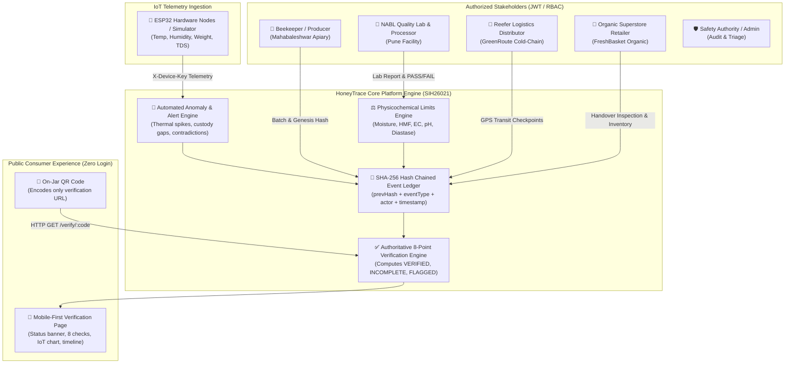

# 🍯 HoneyTrace — Smart India Hackathon 2026 Submission

### **Problem Statement ID: SIH26021**
**Domain / Theme:** Agriculture, FoodTech & Rural Development / Smart Automation & Supply Chain  
**Project Title:** HoneyTrace — End-to-End Cryptographic Traceability, IoT Cold-Chain Telemetry & Quality Verification Platform  
**Target Beneficiaries:** Tribal & Local Beekeepers (FPOs), Quality Testing Labs, Cold-Chain Logistics, Organic Retailers, Regulatory Authorities (FSSAI), and Consumers.

---

## 🏆 SIH26021 Problem Statement Alignment & Innovation

| SIH26021 Challenge / Need | HoneyTrace Technical Solution | Innovation / Tech Highlight |
|---|---|---|
| **1. Origin Authenticity & Anti-Counterfeiting** | Digital apiary registration with geo-tagged GPS coordinates, floral forage classification, and non-guessable batch codes (`HT-YYYY-XXXXXX`). | Unambiguous cryptographic base alphabet preventing clone labels. |
| **2. Adulteration & Sugar Syrup Blends** | Automated physicochemical boundary validation (Moisture $\le 20\%$, HMF $\le 40\text{ mg/kg}$, Diastase $\ge 8$, EC $\le 0.8\text{ mS/cm}$). | Immediate contradiction detection if a lab reports PASS with out-of-limit sugar metrics. |
| **3. Tamper-Proof Chain of Custody** | Append-only event ledger anchored with per-batch **SHA-256 hash chains** (`prevHash + eventHash`). | Mathematical proof of custody handover without costly blockchain gas fees. |
| **4. Cold-Chain & Storage Degradation** | Continuous IoT telemetry stream (ESP32 microcontrollers with temperature, humidity, and weight). | Automated alerts when temperatures exceed $35^\circ\text{C}$ (thermal enzyme breakdown threshold). |
| **5. Zero-Friction Consumer Verification** | Dynamic QR on jars resolving to mobile-first verification page in $<2\text{ s}$. | **8-Point Verification Checklist** with plain-language explanations & zero app download required. |
| **6. Regulatory Supervision & Audits** | Real-time administrative triage console, automated anomaly triggers, and immutable audit logs. | Automated detection of transit delays ($>7\text{ days}$), thermal spikes, and custody sequence violations. |

---

## 📌 Executive Summary

The honey supply chain in India faces widespread **adulteration** (C3/C4 invert sugar syrups, rice syrups, ultra-filtration, excessive heat pasteurization) and **fragmented records** where claims of pure forest honey cannot be validated.

**HoneyTrace** establishes an end-to-end trusted digital pipeline:
$$\text{Beekeeper / Producer} \longrightarrow \text{Quality / Processing Lab} \longrightarrow \text{Cold-Chain Logistics} \longrightarrow \text{Retailer Store} \longrightarrow \text{Consumer}$$

Each honey batch is anchored to an unambiguous identifier. Every harvest, processing step, lab test, and IoT sensor reading is written into an immutable **SHA-256 hash-chained event ledger**. Consumers scan an on-jar QR code to view a transparent **8-point authenticity verification report** on their mobile phone.

---

## 🏛️ System Architecture



---

## 💡 The HoneyTrace "Honest Verification" Philosophy

| What HoneyTrace Verifies | What It Does NOT Claim |
|---|---|
| ✅ **Tamper-Evident Record Trail:** Mathematical proof that all supply chain events are authenticated and unmodified since genesis. | ❌ It does not perform in-vivo spectrometry on your phone. |
| ✅ **Physicochemical Conformance:** Automated verification against certified lab test limits (Moisture $\le 20\%$, HMF $\le 40\text{ mg/kg}$, Diastase $\ge 8$). | ❌ Sensor readings are supporting traceability data, not standalone proof of purity. |
| ✅ **Cold-Chain Thermal Integrity:** Real-time IoT temperature monitoring to detect thermal enzyme breakdown ($>35^\circ\text{C}$). | ❌ Incomplete records are honestly flagged as *"Information Incomplete"*, never deceptively marked authentic. |

---

## 🛡️ Authoritative 8-Point Verification Engine

When a batch code is queried, the verification engine evaluates 8 deterministic checkpoints:

```
[ C1 ] Registered Batch ID & Cryptographic Genesis Hash
[ C2 ] Apiary Origin & Geographic GPS Source Validated
[ C3 ] Final Processing Certified & Additives Disclosed
[ C4 ] Physicochemical Lab Test PASS (FSSAI / Codex Limits)
[ C5 ] IoT Cold-Chain Storage Telemetry Active (<35°C)
[ C6 ] Supply Chain Custody Handover Sequence Complete
[ C7 ] SHA-256 Mathematical Hash Chain Valid (Unbroken)
[ C8 ] Shelf Life Valid (Not Expired) & No Active Recalls
```

### Verification State Classification:
1. **`VERIFIED AUTHENTIC` (Green)**: All 8 checkpoints passed, full unbroken custody handover, verified NABL lab report, active sensor telemetry.
2. **`INFORMATION INCOMPLETE` (Amber)**: Batch is currently moving through supply chain (`IN_TRANSIT`), or intermediate handover step pending.
3. **`FLAGGED / SUSPICIOUS` (Red)**: Active product recall, expired shelf life, failed lab test, thermal abuse ($>40^\circ\text{C}$), or cryptographic hash signature mismatch.
4. **`NOT FOUND / UNREGISTERED` (Slate)**: Code does not exist in the platform registry (prevents counterfeit clone labels).

---

## 🔬 Physicochemical Reference Standards

Configured in `src/config/qualityLimits.ts` in compliance with FSSAI Gazetted Regulations:

| Parameter | HoneyTrace Standard | Standard Limit (FSSAI/Codex) | Technical Significance |
|---|---|---|---|
| **Moisture Content** | $17.0\% - 19.0\%$ | **Max $20.0\%$** | Prevents wild osmophilic yeast fermentation and spoilage. |
| **Hydroxymethylfurfural (HMF)** | $< 25\text{ mg/kg}$ | **Max $40.0\text{ mg/kg}$** | Indicator of thermal abuse or adulteration with acid-inverted sugar syrup. |
| **Diastase Activity** | $> 12\text{ Schade Units}$ | **Min $8.0\text{ Schade Units}$** | Natural bee enzyme that breaks down when honey is heated or aged. |
| **Electrical Conductivity** | $0.3 - 0.6\text{ mS/cm}$ | **Max $0.8\text{ mS/cm}$** | Validates botanical blossom nectar origin vs artificial sugar solutions. |
| **pH Value** | $3.5 - 4.2$ | **$3.2 - 4.5$** | Natural organic acidity that inhibits pathogenic bacterial growth. |
| **Storage Temperature** | $18^\circ\text{C} - 26^\circ\text{C}$ | **Alert at $>35^\circ\text{C}$, Extreme $>40^\circ\text{C}$** | Monitored by ESP32 nodes to prevent enzyme decay during transit. |

---

## 🧪 Pre-Seeded SIH Evaluator Scenarios (1-Click Evaluation)

The application includes 4 deterministic demo scenarios ready for immediate testing:

| Batch Code | Story & Technical Condition | Expected Result |
|---|---|:---:|
| `HT-2026-DEMO01` | **Ravi Kale (Sahyadri Wild Honey)** — Full unbroken journey through FreshBasket Organic. Perfect lab PASS (Moisture 17.8%, HMF 18.4 mg/kg, Diastase 14.6). 20 normal cold-chain IoT readings. | <span style="color:#10b981; font-weight:bold;">VERIFIED</span> |
| `HT-2026-DEMO02` | **Meera Kulkarni (Nashik Apiaries)** — Processed & Quality Approved. Picked up by distributor, currently *in transit* across Pune-Mumbai corridor. | <span style="color:#d97706; font-weight:bold;">INFORMATION INCOMPLETE</span> |
| `HT-2026-DEMO03` | **Flagged Case** — Received at store with missing distributor pickup event (custody gap), HMF elevated to $62.5\text{ mg/kg}$ ($>40$ limit), and IoT thermal spike to $44.1^\circ\text{C}$. | <span style="color:#e11d48; font-weight:bold;">FLAGGED</span> |
| `HT-2026-FAKE99` | **Counterfeit Test** — Unregistered identifier not present in database. Triggers low-severity scan alert. | <span style="color:#64748b; font-weight:bold;">NOT FOUND</span> |

---

## 🚀 Interactive 13-Step SIH Demo Script (PRD §20.2)

Evaluators can click the **"13-Step Guided Demo"** button in the header bar or follow this evaluation sequence:

1. **Producer Login**: Log in as `ravi@sahyadrihoney.demo` (*Sahyadri Wild Honey FPO*).
2. **Register Batch**: Create lot `RAVI-2026-045` with flower origin and harvest details.
3. **Cryptographic Genesis Event**: Batch receives identifier `HT-2026-DEMO01` and `prevHash="GENESIS"`.
4. **Generate QR**: Preview and download the on-jar QR code encoding only the public URL.
5. **IoT Telemetry Stream**: Trigger the built-in sensor simulator to stream temperature and humidity readings.
6. **Processor Logging**: Switch to `processing@sahyadriprocessors.demo`, record micro-cloth filtration and zero additives.
7. **Lab Quality Test**: Switch to `quality@qualichecklabs.demo`, input moisture ($17.8\%$) and HMF ($18.4\text{ mg/kg}$) with `PASS` decision.
8. **Distributor Custody**: Switch to `ops@greenroute.demo`, record pickup, GPS checkpoint, and dispatch to retailer.
9. **Retailer Receipt**: Switch to `store@freshbasket.demo`, inspect condition (`OK`), confirm quantity, and move to shelf stock.
10. **Public Consumer Scan**: Open `/verify/HT-2026-DEMO01` without logging in. See green **VERIFIED AUTHENTIC** banner and 8 checks passed.
11. **Telemetry & Ledger Inspection**: View temperature line charts and expand SHA-256 event hash proofs.
12. **Test Anomaly Cases**: Verify `HT-2026-DEMO03` (Flagged) and `HT-2026-FAKE99` (Not Found).
13. **Admin Console & Audit Trail**: Log in as `admin@honeytrace.demo` to triage safety alerts and inspect the immutable audit log.

> 💥 **Bonus Evaluator Proof (Tamper Simulation)**:  
> Navigate to the **Admin Dashboard $\rightarrow$ Tamper Simulation Tool** and modify any historical event note. The SHA-256 hash recalculation immediately detects a signature mismatch and triggers a `CHAIN_INTEGRITY_FAILURE` alert on the public verification page!

---

## 👥 Stakeholder Role Matrix & Credentials

All seeded demo accounts share password: `HoneyTrace@2026` *(or use 1-click login buttons in the UI)*.

| Role | Name & Entity | Demo Email | Capabilities |
|---|---|---|---|
| **PRODUCER** | Ravi Kale (*Sahyadri Wild Honey*) | `ravi@sahyadrihoney.demo` | Register batches, manage apiary GPS coordinates, download QR codes, assign IoT devices. |
| **PRODUCER** | Meera Kulkarni (*Nashik Valley*) | `meera@nashikapiaries.demo` | Multifloral harvest registration, hive telemetry management. |
| **PROCESSOR** | Sahyadri Processing Unit | `processing@sahyadriprocessors.demo` | Cloth filtration, settling records, max temperature tracking, additives disclosure. |
| **PROCESSOR** | Dr. Anjali Deshmukh (*QualiCheck Labs*) | `quality@qualichecklabs.demo` | NABL lab test entry (Moisture, HMF, Diastase, EC, pH), PASS/FAIL certification. |
| **DISTRIBUTOR** | Sameer Shaikh (*GreenRoute Logistics*) | `ops@greenroute.demo` | Reefer van pickup, intermediate GPS check-ins, retailer dispatch. |
| **RETAILER** | Neha Joshi (*FreshBasket Organic*) | `store@freshbasket.demo` | Delivery condition inspection, shelf inventory management, QR tag printing. |
| **ADMIN** | Vikram Rao (*Platform Operator*) | `admin@honeytrace.demo` | User approvals, alert triage, audit log explorer, tamper demonstration. |
| **CONSUMER** | Any Public Buyer | *No Account Required* | Public camera QR scanning, 8-point checklist verification, IoT telemetry review. |

---

## 💻 Tech Stack & Architecture Highlights

- **Frontend**: React 18 SPA, Vite 6, TypeScript (Strict Mode)
- **Styling**: Tailwind CSS with custom warm honey palette (`honey-50` to `honey-950`), glassmorphic panels, and AA contrast accessibility.
- **Typography**: Google Fonts (*Outfit* display & *Plus Jakarta Sans* body).
- **Cryptographic Engine**: Web Crypto API SHA-256 with fallback synchronous block hashing for offline evaluation guarantee.
- **Charts & Visualization**: Recharts (Cold-chain time-series & verification distribution donut).
- **QR Generation & Scanning**: Canvas-rendered `qrcode` with SVG/PNG downloads + simulated web camera scanner.
- **State Management**: Reactive React Context Store with LocalStorage persistence and 1-click state reset.

---

## 🛠️ Local Installation & Development

```bash
# 1. Clone the repository
git clone https://github.com/saiganesh-ponnod/Honey-Trace.git
cd Honey-Trace

# 2. Install dependencies
npm install

# 3. Start development server
npm run dev

# 4. Open in browser
# http://localhost:5173/
```

### Production Build & Type Check
```bash
npm run build
npm run preview
```

---

## 🗺️ Roadmap & Future Enhancements

- [ ] **Blockchain Anchoring**: Periodic Merkle root anchoring of event hashes to Ethereum/Polygon testnet.
- [ ] **Spectral NMR Integration**: Automated import of Nuclear Magnetic Resonance profile reports from testing laboratories.
- [ ] **Hardware ESP32 Firmware**: Direct MQTT/TLS payload ingestion from LoRaWAN and 4G cellular IoT nodes.
- [ ] **Multilingual Support**: Marathi, Hindi, and regional vernacular interfaces for rural beekeeper ease of use.
- [ ] **Unit-Level Serialization**: Unique serialized QR codes per individual 250g/500g glass jar.

---

<p align="center">
  Submitted for <strong>Smart India Hackathon 2026 (SIH PS: SIH26021)</strong><br />
  Made with 🍯 for transparency, food safety, and beekeeper empowerment.
</p>
